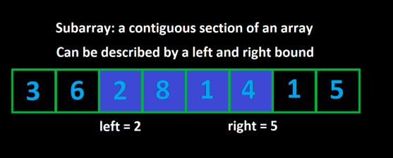

# Sliding Window

ubarrays
Given an array, a subarray is a contiguous section of the array. All the elements must be adjacent to each other in the
original array and in their original order. For example, with the array [1, 2, 3, 4], the subarrays (grouped by length)
are:

```
[1], [2], [3], [4]
[1, 2], [2, 3], [3, 4]
[1, 2, 3], [2, 3, 4]
[1, 2, 3, 4]
```



**Sliding window**

Usa two pointers.

Subarray: seccion continua de un array.

Cuando usar un sliding Window?

* Explicitamente pide un subarray valido o substring.
    * Cuando pide un subarray valido o substring.
    * Restriccion numerica en tu contraint metric.
* Pide encontrar un subarray de alguan forma.
    * el mas comun es best valid subarray.
    * encontrar el numero de arrays validos.

**El algoritmo**

* No crear array nuevos
* Mantener la metrica en una variable
* Modificar la metrica para que cumpla la restriccion numerica

**Es eficiente porque:**

* Buscar por cada subarray es mini On2. Sliding windows puede ser O1 o On.

```bash
function fn(nums, k):
    left = 0
    curr = 0
    answer = 0
    for (int right = 0; right < nums.length; right++):
        curr += nums[right]
        while (curr > k):
            curr -= nums[left]
            left++

        answer = max(answer, right - left + 1)

    return answer
```
```bash
function fn(arr):
    left = 0
    for (int right = 0; right < arr.length; right++):
        Do some logic to "add" element at arr[right] to window

        while WINDOW_IS_INVALID:
            Do some logic to "remove" element at arr[left] from window
            left++

        Do some logic to update the answer
```

** Fixed Window**

```bash
function fn(arr, k):
    curr = some data to track the window

    // build the first window
    for (int i = 0; i < k; i++)
        Do something with curr or other variables to build first window

    ans = answer variable, probably equal to curr here depending on the problem
    for (int i = k; i < arr.length; i++)
        Add arr[i] to window
        Remove arr[i - k] from window
        Update ans

    return ans
```